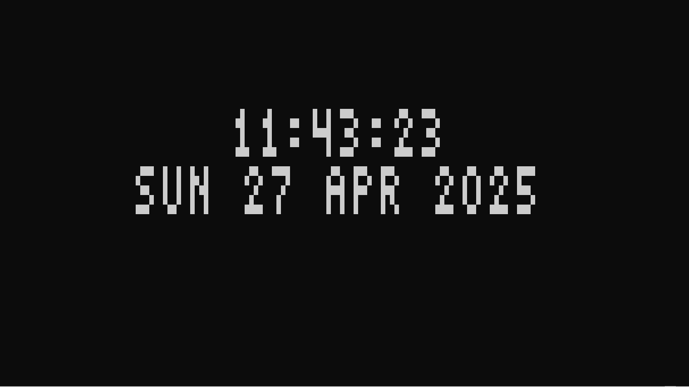

# ⏰ ASCII Digital Clock

A badass CLI-based **ASCII Digital Clock** that displays the current time and date — *centered*, *animated*, and *extra vibey*.

> 🖤 Made to look cool as hell inside your terminal.

---

## 🛠 Features
- Big beautiful ASCII digits for time and date
- Fully **centered** output for any terminal size
- **Auto-refreshes** every second like a real clock
- **Clear screen** for smooth transitions
- Supports **letters, numbers, symbols** (for full date text)
- Works on **Windows** and **Linux/Mac** 🎯

---

## 📸 Preview



---

## 🚀 How to Run

1. Install **Python 3.x** if you don't already have it.
2. Download or clone this repo.
3. Open your terminal and run:

```bash
python clocl.py
